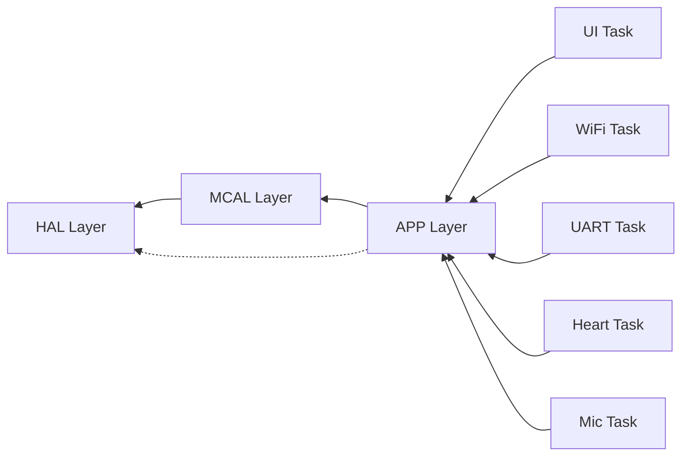
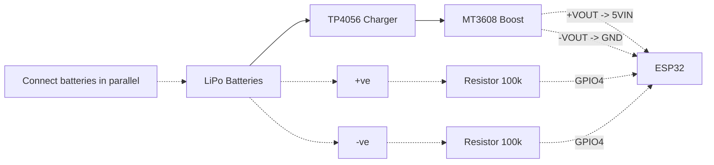
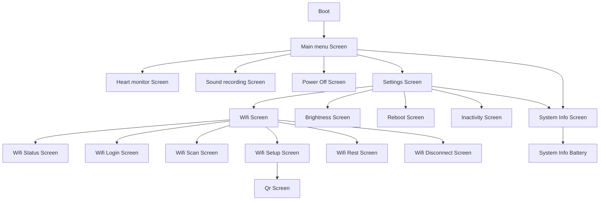

# Smart Stethoscope — Main Entry Point

## System Architecture

## Active Tasks (FreeRTOS)

| Task       | Core   | Priority | Purpose                          |
| ---------- | ------ | -------- | -------------------------------- |
| UI_Task    | Core 1 | P2       | OLED menu and button navigation  |
| WiFi_Task  | Core 0 | P1       | WiFi connection state machine    |
| UART_Task  | Core 0 | P1       | PC serial bridge / debug shell   |
| Heart_Task | Core 0 | P2       | MAX30102 BPM + SpO2 @ 50 Hz      |
| Mic_Task   | Core 0 | P2       | MAX4466 microphone (lung sounds) |

### RTOS Task Architecture (Expanded)

| Task       | Core | Priority | Stack (bytes) | Period | WCET budget | Queue(s) used |
| ---------- | ---- | -------- | ------------- | ------ | ----------- | ------------- |
| UI_Task    | 1    | 2        | 8192          | 20 ms  | 20 ms       | `btnQueue`, `wifiStatusQueue`, `heartQueue`, `micLiveQueue` |
| WiFi_Task  | 0    | 1        | 4096          | 500 ms (50 ms in portal) | 50 ms | `wifiStatusQueue` |
| UART_Task  | 0    | 1        | 4096          | 50 ms  | 50 ms       | `wifiStatusQueue`, `heartQueue` |
| Heart_Task | 0    | 2        | 4096          | 10 ms  | 10 ms       | `heartQueue` |
| Mic_Task   | 0    | 3        | 4096          | 250 µs | 250 µs      | `micLiveQueue` |

### Sensor Interface Table

| Sensor | Interface | Sampling period | Normal range | Invalid range | Failure behavior |
| ------ | --------- | --------------- | ------------ | ------------- | ---------------- |
| Battery divider (LiPo) | ADC (GPIO4) | 5 s | 3.40–3.70 V | <3.40 V or >4.5 V | Clamp to 2.5–4.5 V, flag low/critical |
| MAX4466 Mic | ADC (GPIO3) | 250 µs (4 kHz) | 30–90 dBSPL | <30 dB or >90 dB | Floor/ceiling clamp, clipping flag |
| MAX30102 | I2C (0x57) | 10 ms (100 Hz) | BPM 30–220, SpO2 70–100% | Outside limits | Mark invalid, reset averages |
| Buttons (UP/DOWN/SEL/BACK) | GPIO digital | 20 ms poll + ISR | Active-LOW transitions | Stuck high/low | Ignore/retry, UI remains responsive |

### Requirements (REQ-01…REQ-12)

| ID | Description | Type | Test approach |
| --- | ----------- | ---- | ------------- |
| REQ-01 | Mic task shall sample audio at 4 kHz (250 µs period). | Real-time | SYS timing log (TIMING) |
| REQ-02 | Heart task shall sample MAX30102 at 100 Hz and compute BPM/SpO2. | Functional | SYS heart monitor checks |
| REQ-03 | Battery ADC out-of-range shall be detected and clamped safely. | Fault tolerance | SYS fault injection (FAULT_ADC) |
| REQ-04 | UI task shall poll buttons every 20 ms and wake on ISR semaphore. | RTOS | INT button+UI timing |
| REQ-05 | WiFi shall retry connection up to 3 times within 15 s before failover. | Functional | INT WiFi state machine |
| REQ-06 | Sensor queues shall overwrite with the latest reading without blocking. | RTOS | INT queue tests |
| REQ-07 | UART shell shall parse commands and respond within 200 ms. | Functional | UNIT UART parser + SYS command tests |
| REQ-08 | Shared UART and I2C resources shall be mutex-protected. | RTOS | SYS race/garble test |
| REQ-09 | System shall report WCET, period, and jitter per task via TIMING. | Timing | SYS timing report |
| REQ-10 | System shall enter light-sleep after inactivity timeout. | Power | SYS sleep test |
| REQ-11 | Finger absence shall invalidate heart readings immediately. | Functional | SYS sensor removal test |
| REQ-12 | System shall tolerate 10-minute stress load without reset. | Stress | SYS stress test |

### Requirement Traceability Matrix

| REQ ID | Test IDs |
| ------ | -------- |
| REQ-01 | SYS-08 |
| REQ-02 | INT-04, SYS-01 |
| REQ-03 | SYS-05, FAULT-01 |
| REQ-04 | INT-02, SYS-02 |
| REQ-05 | UNIT-04, INT-03 |
| REQ-06 | INT-04, INT-05 |
| REQ-07 | UNIT-03, SYS-03 |
| REQ-08 | SYS-06 |
| REQ-09 | SYS-08 |
| REQ-10 | SYS-07 |
| REQ-11 | SYS-04 |
| REQ-12 | SYS-09 |

## UART diagnostics 🧭

### RTOS_STATS (what it does)

The `RTOS_STATS` command calls FreeRTOS `vTaskGetRunTimeStats()` and prints a per-task CPU usage report since boot. This helps you see which tasks consume the most runtime under load (e.g., during `STRESS_ON`). It requires these FreeRTOS config flags to be enabled:

- `configGENERATE_RUN_TIME_STATS = 1`
- `configUSE_STATS_FORMATTING_FUNCTIONS = 1`

If those flags aren’t enabled, the command will report that runtime stats are unavailable.

## Components

| Part            | Role           |
| --------------- | -------------- |
| ESP32-S3 Devkit | Main MCU       |
| OLED SSD1306    | Display        |
| MAX30102        | Pulse oximeter |
| MAX4466         | Microphone     |
| Buttons         | UI input       |
| Battery         | Portable power |

## I2C Addresses

| Device       | Address |
| ------------ | ------- |
| OLED SSD1306 | 0x3C    |
| MAX30102     | 0x57    |
| MAX4466      | 0x68    |

## ESP32-S3 Wiring

| Component       | ESP32-S3 GPIO | Notes                        |
| --------------- | ------------- | ---------------------------- |
| OLED SDA        | GPIO 8        | Shared I2C bus               |
| OLED SCL        | GPIO 9        | Shared I2C bus               |
| MAX30102 SDA    | GPIO 8        | Shared I2C bus               |
| MAX30102 SCL    | GPIO 9        | Shared I2C bus               |
| MAX4466_OUT     | GPIO 3        | Analog input                 |
| BTN_SELECT      | GPIO 10       | Active-LOW, internal pull-up |
| BTN_BACK        | GPIO 11       | Active-LOW, internal pull-up |
| BTN_UP          | GPIO 12       | Active-LOW, internal pull-up |
| BTN_DOWN        | GPIO 13       | Active-LOW, internal pull-up |
| Battery divider | GPIO 4        | VBAT → R1 → GPIO4 → R2 → GND |

## Battery + Power Chain

## Screens

